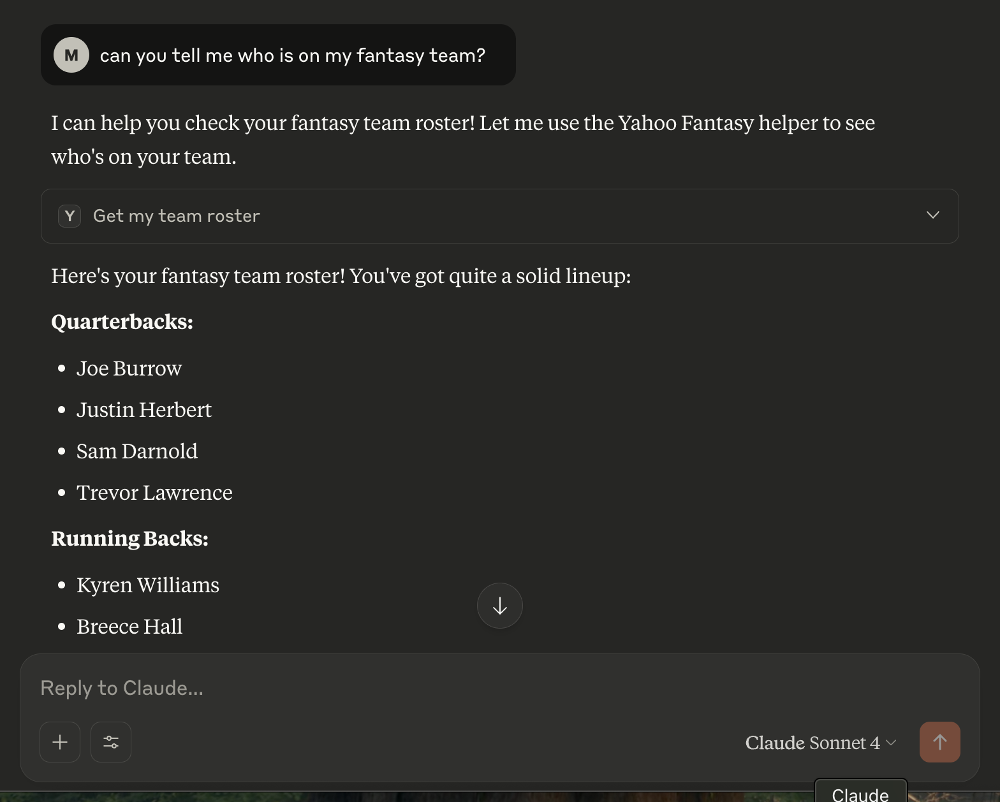

# local-mcp-servers

This repository contains multiple subdirectories, each representing a standalone MCP (Model Context Protocol) server. These MCPs can be run locally and connected to Claude Desktop or other MCP-compatible clients.

This is an exploration of MCP and figuring out how to incorporate it into my local workflow.  It will be a work in progress for some time, I imagine.  Currently, I setup one successfully to connect Claude Desktop to a local MCP server connected to the Yahoo Fantasy Sports API.

## Current Projects

**Yahoo Fantasy Sports MCP:** A local MCP server that interfaces with the Yahoo Fantasy Sports API to provide fantasy sports data and functionality.



## Future projects

**Kroger MCP:** Implement a local MCP server for Kroger's API to assist with grocery shopping.

## Structure

- Each subdirectory (e.g., `mcp-fantasy-draft/`) is a self-contained MCP server with its own dependencies and configuration.
- Example directory structure:

```
local-mcp-servers/
├── mcp-fantasy-draft/
│   ├── server.py
│   ├── requirements.txt
│   └── ...
├── another-mcp/
│   ├── server.py
│   └── ...
└── README.md
```

## Running an MCP Server locally

1. Navigate to the desired MCP subdirectory:
	```sh
	cd mcp-fantasy-draft
	```
2. Set up the environment and install dependencies:
	```sh
	uv init
	uv pip install -r requirements.txt
	```
3. Start the MCP server:
	```sh
	python server.py
	```

## Connecting to Claude Desktop

1. Open Claude Desktop and go to the MCP configuration/settings or manually go there. See example below
2. Add a new MCP server, specifying the correct path to python executable and `server.py`.
3. Save and enable the connection and restart Claude. Claude Desktop will now route requests to your local MCP server and the Tools should be available.

### Claude Desktop MCP Config Example
**Note: Example has relative path, needs to be full path for config**


```json
{
  "mcpServers": {
    "yahoo-fantasy-helper": {
      "command": "./local-mcp-servers/mcp-fantasy-draft/.venv/bin/python", 
      "args": ["./local-mcp-servers/mcp-fantasy-draft/server.py"],
      "transport": "stdio"
    }
  }
}
```

## Lessons learned, gotchas & resources

* Paths in the MCP configuration must be absolute or correctly relative to the working directory. That said, .env files work with python-dotenv which is nice
* Doc strings / documentation of tools are in server.py, not Claude Desktop config (makes sense, not what I expected though)


## TODO

* Currently using stdio (standard input/output) for connection, want to consider a different setup using HTTP, WebSocket, or other protocols.
* Think about where / if I want to store Claude desktop configuration files for easier management and version control.
