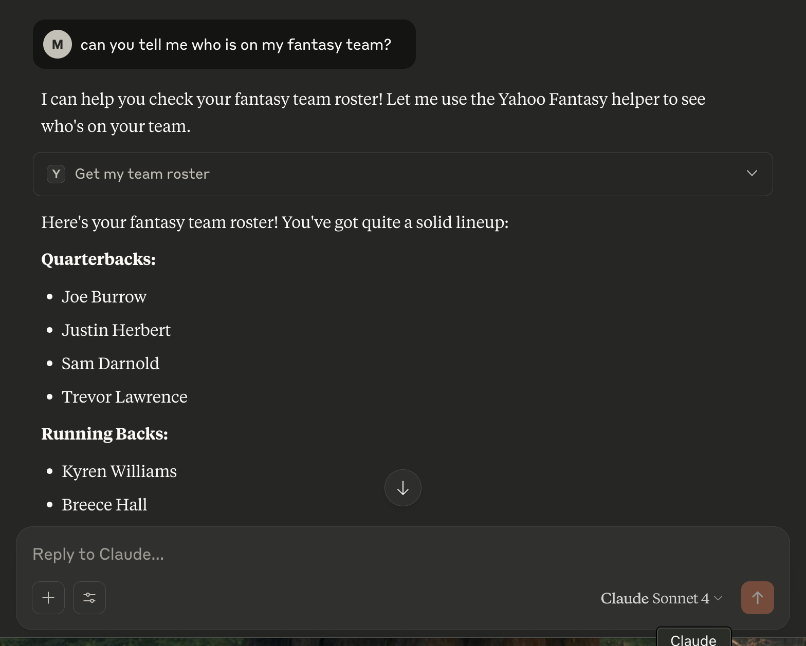

## mcp-fantasy-draft

A simple MCP server for Yahoo Fantasy Football tools. Also, my first MCP server setup locally to interact with Claude Desktop as a front-end client. I wanted to be able to use Claude during my fantasy draft to ask questions about my team and available players.  It worked well for a first attempt!




* Screenshot from testing with last year's team data.

## Features
- `get_my_team_roster(team_id)`: Get your team's roster and positions.
- `get_drafted_players(league_id)`: List drafted players, positions, and percent owned.


## Requirements
- Python `3.12` (see `.python-version`).
- Yahoo OAuth2 credentials stored locally in `oauth2.json` (not committed).
- Package manager: `uv` (currently used) or `pip`.


## Quick Start

1. **Install Python 3.12**  
  (Check `.python-version` for the required version.)

2. **Set up Yahoo OAuth2**  

  > **Note:** You will need to go to the [Yahoo Developer Portal](https://developer.yahoo.com/apps/) and set up an application to obtain your client ID and client secret before running the next step.

Create a file `oauth2.json` (added to local .gitignore already) with the following structure:

```json
   {
    "consumer_key": "my_very_long_and_weird_consumer_key",
    "consumer_secret": "my_not_that_long_consumer_secret"}
```
  Run:
  ```sh
  python auth_setup.py
  ```
  This updates your  `oauth2.json` with refresh tokens so you don't have to authenticate every time.

3. **Configure Environment**  
   - Copy `.env.example` to `.env`
   - Set your values for:
     - `OAUTH2_PATH=/full/path/to/oauth2.json`  *(must be a full path for MCP to work at run time)*
     - `LEAGUE_ID=your_league_id`
     - `TEAM_ID=your_team_id`

4. **Install Dependencies**  
  - Preferred:
    ```sh
    uv sync
    ```
  - Or fallback:
    ```sh
    pip install -r requirements.txt
    ```

5. **Run the Server**  
  ```sh
  python server.py
  ```


## Configuration
- League and team IDs are now set in your `.env` file:
  - `LEAGUE_ID=your_league_id`
  - `TEAM_ID=your_team_id`
- You can override by passing arguments to the tools or by editing `.env`.
- `OAUTH2_PATH` defaults to `./oauth2.json` if the env var is not set.


## Security
- Never commit `oauth2.json` or `.env`. They are .gitignored, but calling out since oauth2.json is less common.


## Project Files
- `server.py`: Main server
- `auth_setup.py`: OAuth helper, one time setup
- `league_settings.json`: League config - outputted to provide context
- `.env.example`: Example env file


## Troubleshooting
- **Missing OAUTH2_PATH**: Check `.env` and `oauth2.json`.
- **Token expired**: Run `python auth_setup.py` again.


## TODO
* Add more features to search waiver wire
* Documentation and a little clean up