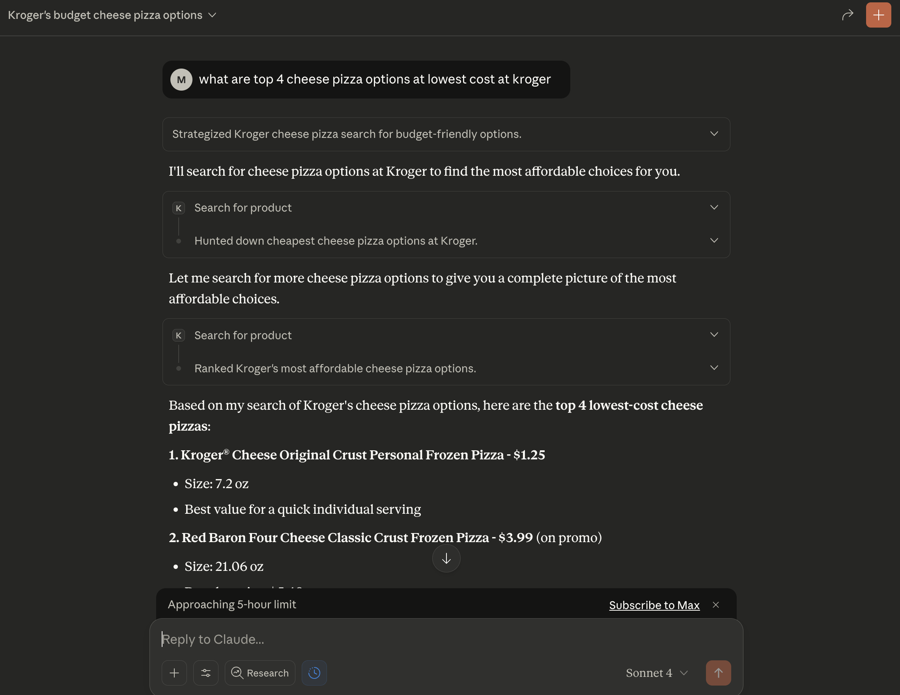

## mcp-kroger

A dual-mode Kroger toolkit with a shared Python core. It exposes:

- An MCP server for Claude Desktop (auto-discovers tools).
- A CLI wrapper (`kroger` command) suitable for Copilot CLI or shell scripting.



* Screenshot from a sample product search.

## Features
- Shared core service for Kroger auth, search, and cart operations.
- `kroger` CLI: `kroger search "milk" --json` and `kroger cart add --upc ... --qty ...`.
- MCP server (`python server.py`) with tools for product search and add-to-cart.


## Requirements
- Python `3.12` (see `.python-version` if present).
- Kroger API credentials stored locally (not committed).
- Package manager: `uv` (preferred) or `pip`.

## Quick Start

1. **Install Python 3.12**  
	(Check `.python-version` for the required version.)

2. **Set up Kroger API Credentials**
        > **Note:** You will need to register for Kroger API access and obtain your client ID and client secret. Store credentials securely and do not commit them.

        Run:
        ```sh
        python utils/auth.py
        ```
        This stores tokens under `$XDG_CONFIG_HOME/kroger/` (or `~/.config/kroger/`) for reuse by both MCP and CLI.

3. **Configure Environment**  
	- Copy `.env.example` to `.env` (if provided)
	- Set your values for:
	  - `KROGER_CLIENT_ID=your_client_id`
	  - `KROGER_CLIENT_SECRET=your_client_secret`
	  - `ZIP_CODE=your_zip_code`

4. **Install Dependencies**
        - Preferred (if uv is available):
          ```sh
          uv sync
          ```
        - Or fallback:
          ```sh
          pip install -r requirements.txt
          ```

5. **Run the MCP Server**
        ```sh
        python server.py
        ```

6. **Use the CLI (Copilot/Shell Friendly)**
        ```sh
        PYTHONPATH=src python -m kroger_cli search "milk" --limit 3 --json
        PYTHONPATH=src python -m kroger_cli cart add --upc 000000000 --quantity 1
        ```
        The CLI powers Copilot CLI tool calls (e.g., `uv run kroger search "milk" --json`). Installing the package (`pip inst
        all -e .`) also exposes the `kroger` console script.

## Configuration
- API credentials and zip code are set in your `.env` file.
- You can override by passing arguments to the tools or by editing `.env`.


## Project Files
- `server.py`: MCP server entrypoint reusing the shared Kroger core.
- `src/kroger_core/`: Shared service + formatting utilities.
- `src/kroger_cli/`: Typer-powered CLI wrappers (Copilot-friendly).
- `utils/auth.py`: Kroger API authentication helper (writes tokens to config dir).
- `.env.example`: Example env file (if present)

## Troubleshooting
- **Missing credentials**: Check `.env` and your credentials file.
- **Token expired**: Run `python utils/auth.py` again.

## TODO
* Expand CLI coverage (cart review, store lookup).
* Improve documentation and error handling.